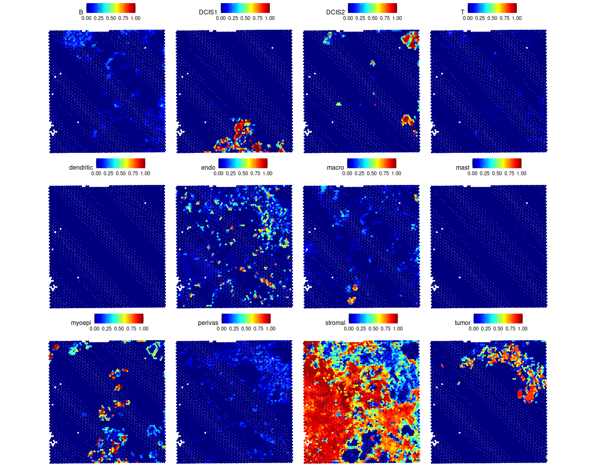
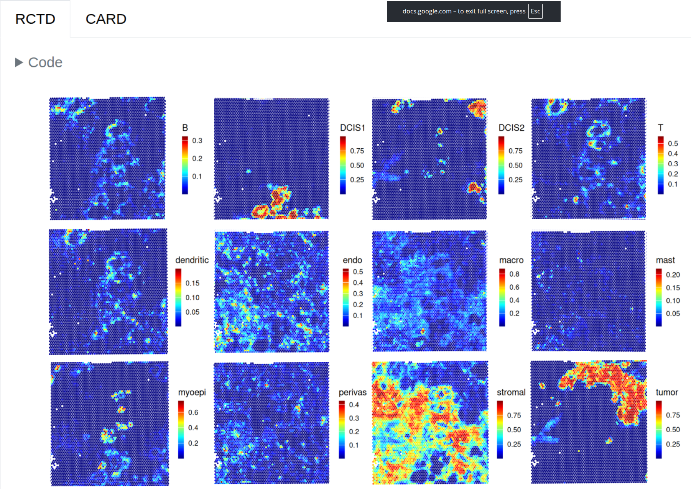
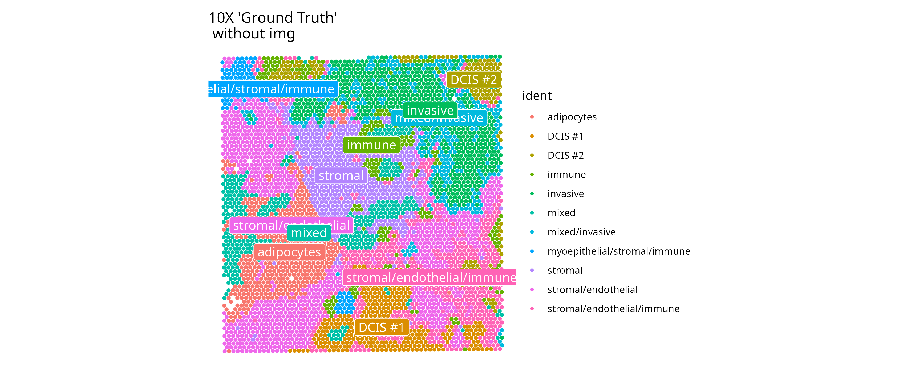

Date released: 2026-06-29

Author: Bilal Asser

(Hardware needs minimum 16GB memory to run this)

## Purpose of this work:

This workflow provides a practical intro to Tumour Microenvironment (TME) analysis using Spatial Transcriptomics data (10X Visium), for learners who have some experience with single cell and spatial transcriptomics analysis in Seurat through the vignettes.

## Aims:

1)  Spatial transcriptomics workflow interoperation by translating the OSTA chapter 12 workflow to the Seurat framework.
2)  Visually compare differences in spatial maps produced by my deconvolution using `Seurat::FindTransferAnchors()` and OSTA's deconvolution using RCTD.
3)  Use NMI to quantify the change in spatial alignment between spatial maps from `Seurat::FindTransferAnchors()` and RCTD after affine registration with the NiftyReg algorithm.
4)  Calculate match rates between Seurat predictions and spot annotations ("ground truth") supplied by 10X.

(Bonus) Visually compare Seurat's UMAP clustering vs the cell type IDs provided by 10X genomics.

## Results

- **Question answered:** Do the spatial maps from this TME dataset visually differ when produced with Seurat’s integration-based deconvolution instead of RCTD’s probabilistic deconvolution?

 
<em>My reverse-engineered results: Seurat cell type identification of the Janesick et al. breast tumour Visium sample</em>

  

 
<em>Original results from OSTA: RCTD/Bioconductor cell type identification of the Janesick et al. breast tumour Visium sample (images needed flipping, no other manipulations done)</em>

  

 
<em>Spot annotations provided by 10X Genomics (for guidance)</em>

   

### Quick tutorial notes

##### Breast cancer TME:

- DCIS is Ductal Carcinoma in situ. These cells are preinvasive cancer cells still confined to the milk ducts.
- Stromal cells in the breast cancer microenvironment are non-cancerous cells that provide structural and biochemical support to the tumour, affecting its progression, metastasis, and therapy resistance.

##### NMI:

- Normalised Mutual Information (NMI) is a measure of the similarity of two images.
- NiftyReg is a visual pattern detection algorithm which finds and registers statistical transformations on a source image to make it more similar to a query image (increasing their NMI score). (statistical transformation examples: rotation, scale, shear, translation)
  - If two images lack shared structural patterns, NiftyReg cannot artificially increase their similarity.

### NMI Similarity (Seurat vs RCTD deconvolution algorithms)

- **Question answered:** Is there a change in NMI achieved by optimally aligning the Seurat map to the RCTD map using affine transformations?

(Test was done on first and second image in Results section)

High NMI before, and increase in NMI after applying affine registration to images shows that both methods make similar spatial patterns of cell type predictions.

### Moderate Match Rates in tumour or preinvasive DCIS cells (Seurat Predictions vs 10X annotations)

- **Question answered:** How close are Seurat's cell type predictions to the annotation provided by 10X? (where the predictions are comparable)

*(Match rates are only calculated for a subset of cell types (DCIS #1, DCIS #2, invasive, stromal) in the ground truth annotation, which matched the cell types in the deconvolution reference.)*

DCIS1: 54.9% correct

DCIS2: 60.0% correct

Tumor: 60.9% correct

Stromal: 99.3% correct (not breast cancer, nor hard to identify)

### TME observations:

- DCIS1 and DCIS2 spots do not overlap - distinct populations.
- Myoepithelial cells line the ducts and their spots overlap with both DCIS subtypes - DUCTAL carcinoma in situ (more in Seurat than RCTD image). (Note: large proportion of DCIS1 and DCIS2 spots from the 10X annotation were ID'd as myoepithelial by deconvolution. Since the overlap makes biological sense, it could be that the 10X annotation is limited?)
- DCIS2 and tumour regions do some bordering of each other.
- Stromal cells are concentrated around the tumour which makes sense because of the well-characterised desmoplastic response. (Confusion matrix also shows DCIS1/2 and tumour spots often ID'd as stromal between 10X annotation and deconvolution. Not clear which is wrong/limited and colocalisation makes sense, as with myoepithelial/DCIS confusions.)
- Endothelial spots are scattered througout but concentrated around tumour because of angiogenesis. (clearer with Seurat?) (Overlap seen in confusion matrix again, with tumour and not DCIS cells. This colocalisation also makes sense.)
- Seurat predicted a low level of perivascular cells overlapping with the tumour region, potentially also showing angiogenesis. (I can't see this in the OSTA predictions).
- Macrophages are recruited to stromal-DCIS interfaces - immune infiltration. Similar to Tumour-associated macrophages (TAMs) but at site of preinvasive population. Some TAMs seen too. (more in RCTD)

## Limitations:

- The sample is one spatial transcriptomics slide/slice.
- No analysis is made into why one prediction algorithm captures certain oncological info better than the other.
- Did not find markers for clusters.
- This version only calculates a confusion matrix against 10X annotations for the Seurat results.
- Match rates are only calculated for a subset of cell types (DCIS #1, DCIS #2, invasive, stromal) in the 10X "ground truth" annotations, those which matched the cell types in the deconvolution reference.
- I do not have the methodology for 10X cell type identification.

## Conclusion

Despite moderate cancer cell spot identification rates in the confusion matrix, biologically meaningful spatial patterns that make oncological sense are still captured by the Seurat prediction algorithm. This project was not sufficient in scope to answer whether the limitation causing the confusion lied with the spot annotations from 10X, or with Seurat's deconvolution algorithm. Seurat's deconvolution algorithm produced highly but not completely similar predictions to RCTD.

The moderate match rates between deconvolution predictions and annotations used as "ground truth", combined with the high similarity between Seurat and RCTD predictions, suggest that either the capture of ground truth annotations or the spatial transcriptomics deconvolution of the breast TME is fundamentally challenging. This is presumably due to the intermingled nature of cell populations and the cellular transformation process in cancer.

## Notes

As always, remember the limitations.

Please create an issue if this workflow could be improved or made more robust.

## Links to project inspiration:

Use this link to see the original workflow the OSTA ebook authors wrote, that I adapted this script from

<https://bioconductor.org/books/release/OSTA/pages/seq-deconvolution.html>

To skip to the images (Note: Deconvolution result images are flipped vertically in this link)

<https://bioconductor.org/books/release/OSTA/pages/seq-deconvolution.html#visualization>

## References:

Citations are provided in `references.txt` and dependencies in `session_info_[timestamp].txt`.
